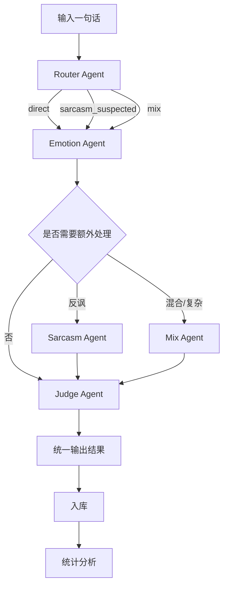

# 一、当前最适合的简化架构

## 保留 5 个 Agent

### 1. Router Agent

负责分流，判断这句话属于：

* `direct`：直接表达
* `sarcasm_suspected`：疑似反讽
* `mix`：混合/复杂/模糊情绪

它决定后面调谁。

---

### 2. Emotion Agent

负责基础判断：

* 主情绪类别
* 强度分数
* 结构化特征

它偏“表层识别”。

---

### 3. Sarcasm Agent

负责处理反讽：

* 是否反讽
* 表层情绪
* 真实情绪
* 强度修正

---

### 4. Mix Agent

负责处理：

* 混合情绪
* 模糊情绪
* 转折句
* 压抑表达
* 非典型情绪词表达

比如：

* “开心是开心，但也挺累”
* “说不上难过，就是提不起劲”
* “终于结束了，轻松，但有点空”
* “不至于生气，就是很烦，很堵”
* “其实还好，就是突然什么都不想做”

这类句子如果只交给 Emotion Agent，通常会被压成单标签，信息损失很大。

---

### 5. Judge Agent

负责最后融合：

* Router 结果
* Emotion Agent 结果
* Sarcasm Agent 结果
* Mix Agent 结果

输出统一结果。

---

# 二、为什么这样最合理

 **分词完全可以让 Agent 顺手做** ，前提是你把输出格式卡死。

只要 Emotion Agent 输出时带上这些字段就够：

* `tokens`
* `emotion_words`
* `degree_words`
* `negation_words`
* `contrast_words`
* `emotion`
* `intensity`
* `confidence`
* `reason`

这样既保留了结构化信息，也不增加调用链长度。

---

# 三、推荐的完整流水线

下面给出一版最适合当前阶段的完整流水线。

---

## Step 1 输入一句话

输入格式统一成：

```json
{
  "id": "msg_001",
  "user_id": "u_1001",
  "text": "太好了，周末又能继续改需求了。",
  "source": "chat",
  "created_at": "2026-03-24T14:00:00"
}
```

---

## Step 2 Router Agent

### 职责

Router Agent 只做两件事：

1. 判断这句话属于哪种表达类型
2. 判断后续要不要调用 Sarcasm Agent 或 Mix Agent

### 建议的样本类型

第一版保留这 3 类：

* `direct`：直接表达
* `sarcasm_suspected`：疑似反讽
* `mix`：混合/复杂/模糊情绪

### Router Agent 输出

```json
{
  "sample_type": "sarcasm_suspected",
  "need_sarcasm_check": true,
  "need_mix_check": false,
  "routing_reason": "句子中存在表面正向词“太好了”，但场景“周末继续改需求”偏负向，疑似反讽"
}
```

### Router 判断规则建议

### 判为 `direct`

满足：

* 有明显情绪词
* 没有明显转折
* 没有明显反讽结构
* 没有明显复合情绪

例子：

* 我今天很开心
* 我有点烦
* 我现在特别焦虑

---

### 判为 `sarcasm_suspected`

满足：

* 句面正向，语境负向
* 或夸张正向词和明显糟糕事件并存
* 有“又”“还真是”“真棒”“太好了”等典型反讽触发词

例子：

* 太好了，又开会到晚上十点
* 真棒，需求又改了

---

### 判为 `mix`

满足：

* 有转折词或复合表达
* 有两个情绪方向
* 句意模糊、情绪不是单标签能解释清楚
* 存在低能量或压抑表达

例子：

* 开心是开心，但也挺累
* 不算难过，就是提不起劲
* 轻松是轻松，但心里有点空
* 不知道怎么说，就是堵得慌

---

## Step 3 Emotion Agent

这是第一版主力 Agent。

### 职责

一次性完成这些事：

* 识别主情绪
* 给出情绪强度分数
* 输出结构化语言特征
* 给出初步解释

### 第一版标签集

先固定 6 类：

* 开心
* 悲伤
* 愤怒
* 焦虑
* 厌烦
* 中性

后面再扩“疲惫、失落、无奈”。

### Emotion Agent 输出格式

```json
{
  "tokens": ["太好了", "周末", "又", "能", "继续", "改", "需求"],
  "emotion_words": ["太好了"],
  "degree_words": [],
  "negation_words": [],
  "contrast_words": [],
  "emotion": "开心",
  "intensity": 62,
  "confidence": 0.61,
  "reason": "文本表面存在明显正向表达“太好了”，情绪方向初步判为正向"
}
```

### 关键点

这里即便它被反讽骗了也没关系。

因为第一版就是让它做 **表层情绪判断** ，后面交给 Sarcasm Agent 或 Mix Agent 来修正。

---

## Step 4 Sarcasm Agent / Mix Agent

### 4.1 Sarcasm Agent

这个是必须保留的，因为一句话情绪识别里， **反讽就是最容易让系统翻车的香蕉皮** 。

### 职责

* 判断句子是否反讽
* 如果是，给出真实情绪
* 修正强度

### 什么时候调用

只有当 Router 觉得：

* `need_sarcasm_check = true`

时才调用，别每句话都查，不然成本高且噪音多。

### Sarcasm Agent 输出格式

```json
{
  "is_sarcasm": true,
  "surface_emotion": "开心",
  "true_emotion": "厌烦",
  "revised_intensity": 74,
  "confidence": 0.85,
  "reason": "表面正向词“太好了”与负面工作场景“周末继续改需求”形成明显反讽，真实情绪偏厌烦"
}
```

### 反讽判断规则建议

重点看：

* 正向词 + 负向事件
* 夸张赞美 + 抱怨语境
* “又”这类重复受害信号
* 加班、改需求、被催、开会到很晚等负面场景

### 典型反讽样例

* 太好了，又来活了
* 真棒，凌晨还在改
* 谢谢你让我周末也这么充实

---

### 4.2 Mix Agent

Mix Agent 用来处理单标签说不清楚的情况。

### 职责

1. 识别是否存在复合情绪
   例如：

* 开心 + 疲惫
* 轻松 + 失落
* 焦虑 + 期待

1. 识别模糊情绪
   例如：

* 空
* 堵
* 麻了
* 提不起劲
* 说不上来

1. 提取主次情绪
   不是只给一个标签，而是给：

* 主情绪
* 次情绪
* 混合比例

1. 处理转折结构
   例如：

* 虽然……但是……
* 不是……就是……
* 开心是开心，但……
* 也不是不……

1. 评估表达清晰度
   因为有些句子本身就不适合给特别高的置信度。

### Mix Agent 输出格式

```json
{
  "is_mixed": true,
  "primary_emotion": "疲惫",
  "secondary_emotion": "开心",
  "mix_ratio": {
    "疲惫": 0.58,
    "开心": 0.42
  },
  "revised_intensity": 57,
  "confidence": 0.79,
  "reason": "句子存在转折结构“但”，前半句表达正向结果，后半句突出疲惫感，属于混合情绪"
}
```

### Mix 典型样例

* 开心是开心，但也挺累
* 终于忙完了，轻松，但有点空
* 也不是特别难过，就是一点劲都没有
* 其实挺期待的，但又很慌

---

## Step 5 Judge Agent

Judge Agent 是最后裁判。

### 职责

* 读取 Router、Emotion、Sarcasm、Mix 的结果
* 决定最终情绪
* 决定最终分数
* 输出统一 JSON

### Judge 决策逻辑建议

### 情况 1：`sample_type = direct`

直接采用 Emotion Agent 结果。

### 情况 2：`sample_type = sarcasm_suspected`

* 如果 Sarcasm Agent 判断 `is_sarcasm = true`
  * 优先采用 `true_emotion`
  * 优先采用 `revised_intensity`
* 如果 Sarcasm Agent 置信度低
  * 保留 Emotion Agent 结果
  * 降低总置信度

### 情况 3：`sample_type = mix`

* 优先采用 Mix Agent 的主情绪和次情绪
* 最终输出中增加 `secondary_emotion`
* 若 Mix Agent 置信度低，则回退到 Emotion Agent 并降低总置信度

### Judge Agent 输出格式

```json
{
  "final_emotion": "厌烦",
  "secondary_emotion": null,
  "final_intensity": 74,
  "final_confidence": 0.83,
  "is_sarcasm": true,
  "is_mixed": false,
  "reason": "句子表面为正向表达，但经反讽识别后，真实情绪为对持续工作任务的不满与厌烦"
}
```

---

# 四、流程图

```
输入一句话
   ↓
Router Agent
   ├─ direct ─────────────→ Emotion Agent ───────→ Judge Agent
   ├─ sarcasm_suspected ─→ Emotion Agent ─→ Sarcasm Agent ─→ Judge Agent
   └─ mix ───────────────→ Emotion Agent ─→ Mix Agent ─────→ Judge Agent
   ↓
统一输出结果
   ↓
入库
   ↓
统计分析
```



---

# 五、最终统一输出 Schema

建议对外统一暴露这一份结果：

```json
{
  "id": "msg_001",
  "text": "太好了，周末又能继续改需求了。",
  "sample_type": "sarcasm_suspected",
  "emotion": "厌烦",
  "secondary_emotion": null,
  "intensity": 74,
  "confidence": 0.83,
  "is_sarcasm": true,
  "is_mixed": false,
  "reason": "句子表面为正向表达，但真实语义是对持续加班改需求的厌烦",
  "tokens": ["太好了", "周末", "又", "能", "继续", "改", "需求"],
  "emotion_words": ["太好了"],
  "source": "chat",
  "created_at": "2026-03-24T14:00:00",
  "model_version": "prompt-agent-v1.1"
}
```

对于 mix 句子，结果示例：

```json
{
  "id": "msg_002",
  "text": "开心是开心，但也挺累。",
  "sample_type": "mix",
  "emotion": "疲惫",
  "secondary_emotion": "开心",
  "intensity": 57,
  "confidence": 0.79,
  "is_sarcasm": false,
  "is_mixed": true,
  "reason": "句子存在转折结构，表达了开心与疲惫并存的混合情绪，后半句疲惫感更突出",
  "tokens": ["开心", "是", "开心", "但", "也", "挺", "累"],
  "emotion_words": ["开心", "累"],
  "source": "chat",
  "created_at": "2026-03-24T14:05:00",
  "model_version": "prompt-agent-v1.1"
}
```

---

# 六、完整执行顺序

```
输入一句话
   ↓
Router Agent
   ↓
Emotion Agent
   ↓
如果 need_sarcasm_check = true，则调用 Sarcasm Agent
如果 need_mix_check = true，则调用 Mix Agent
   ↓
Judge Agent
   ↓
输出结果
   ↓
入库
   ↓
做统计分析
```

---

# 七、数据库建议

第一版至少两张表。

## 1. 原始文本表 `raw_text`

字段：

* `id`
* `user_id`
* `text`
* `source`
* `created_at`

## 2. 分析结果表 `emotion_result`

字段：

* `text_id`
* `sample_type`
* `emotion`
* `secondary_emotion`
* `intensity`
* `confidence`
* `is_sarcasm`
* `is_mixed`
* `reason`
* `tokens`
* `emotion_words`
* `model_version`
* `created_at`

---

# 八、Prompt 控制重点

为了保证链路稳定，所有 Agent 都必须强约束输出。

## Router Agent

只允许输出：

* `sample_type`
* `need_sarcasm_check`
* `need_mix_check`
* `routing_reason`

## Emotion Agent

只允许输出：

* `tokens`
* `emotion_words`
* `degree_words`
* `negation_words`
* `contrast_words`
* `emotion`
* `intensity`
* `confidence`
* `reason`

## Sarcasm Agent

只允许输出：

* `is_sarcasm`
* `surface_emotion`
* `true_emotion`
* `revised_intensity`
* `confidence`
* `reason`

## Mix Agent

只允许输出：

* `is_mixed`
* `primary_emotion`
* `secondary_emotion`
* `mix_ratio`
* `revised_intensity`
* `confidence`
* `reason`

## Judge Agent

只允许输出：

* `final_emotion`
* `secondary_emotion`
* `final_intensity`
* `final_confidence`
* `is_sarcasm`
* `is_mixed`
* `reason`

并且都要求：

* 固定 JSON
* 不允许多余解释
* 不允许输出 markdown
* 不允许自造字段

---

# 九、可以直接讲给团队的最终版本

## 第一版系统目标

实现一句话情绪识别，支持：

* 基础情绪分类
* 强度评分
* 反讽修正
* 混合情绪处理

## 第一版 Agent 架构

* Router Agent：判断句子类型，决定是否调用反讽识别或混合情绪识别
* Emotion Agent：输出表层情绪类别、强度分数和结构化语言特征
* Sarcasm Agent：识别反讽并修正真实情绪
* Mix Agent：识别混合/复杂/模糊情绪并补充主次情绪
* Judge Agent：融合结果并输出最终结论

## 第一版流程

1. 输入一句话
2. Router Agent 判断类型
3. Emotion Agent 输出基础情绪和强度
4. 若疑似反讽，则调用 Sarcasm Agent
5. 若为混合/复杂情绪，则调用 Mix Agent
6. Judge Agent 输出最终结果
7. 入库并做基础统计分析

## 第一版输出

* `emotion`
* `secondary_emotion`
* `intensity`
* `confidence`
* `is_sarcasm`
* `is_mixed`
* `reason`

---

* 开心
